# VARTM Resin Infusion Flow‑Front Assessment Algorithm (VRIFA)

The VARTM Resin Infusion Flow‑Front Assessment Algorithm detects and visualizes the advancing resin flow‑front in VARTM videos. It compares each frame to the dry reference, builds a contrast map, and outputs per‑frame masks, red‑edge overlays, heatmaps, and videos(optional).

## 1) Description
- Purpose: map the moving flow-front from a single RGB video captured during infusion.
- Approach: contrast-to-reference in CIELAB + smoothing + morphology + visualization.
- Footprint: single Python script (CPU), writes PNGs and optional MP4s.

## 2) Usage & Setup
### Setup
1. Install Python 3.9+.
2. (Recommended) create a virtual environment:
   ```bash
   python -m venv .venv && source .venv/bin/activate
   ```
3. Install dependencies:
   ```bash
   pip install -r requirements.txt
   ```

### Basic usage
```bash
python vrifa.py \
  --video-path docs/assets/demo_input.mp4 \
  --output-dir demo_run \
  --frame-step 1 \
  --roi-margin 0.15 \
  --write-videos
```

### Variations
- Faster pass (sample every 3rd frame):
  ```bash
  python vrifa.py --video-path <your.mp4> --output-dir fast --frame-step 3
  ```
- Tighter ROI and stronger smoothing:
  ```bash
  python vrifa.py --video-path <your.mp4> --output-dir tuned \
    --roi-margin 0.10 --blur-kernel 11 --morph-kernel 15 --min-area 600
  ```
- No videos (PNGs only): omit `--write-videos`.

## 3) Outputs & Samples
On each run the tool creates:
- `<out>/masks/` – binary mask of the detected region.
- `<out>/overlays/` – input frame with the front edge in red.
- `<out>/heatmap/` – Turbo colormap of the normalized contrast.
- `<out>/videos/` – optional MP4s when `--write-videos` is set.

### Sample input frames
Dry to near-complete infusion snapshots:

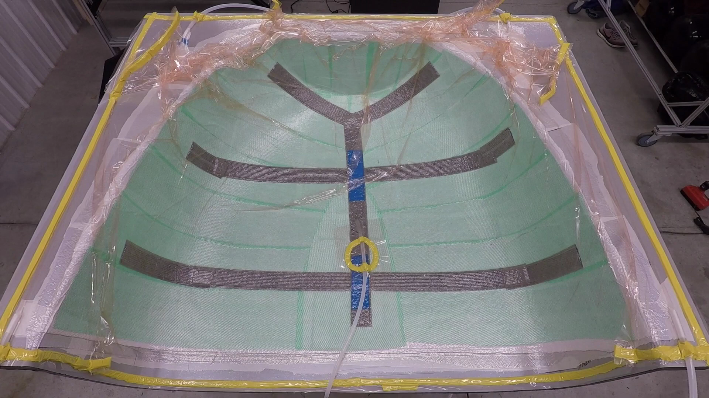
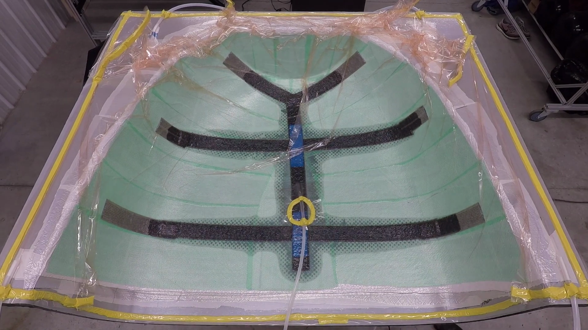

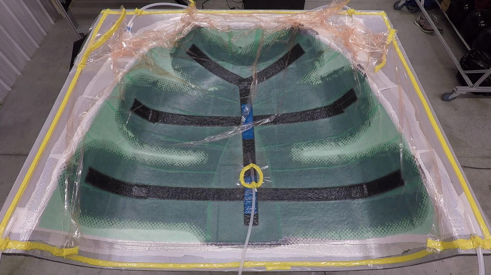
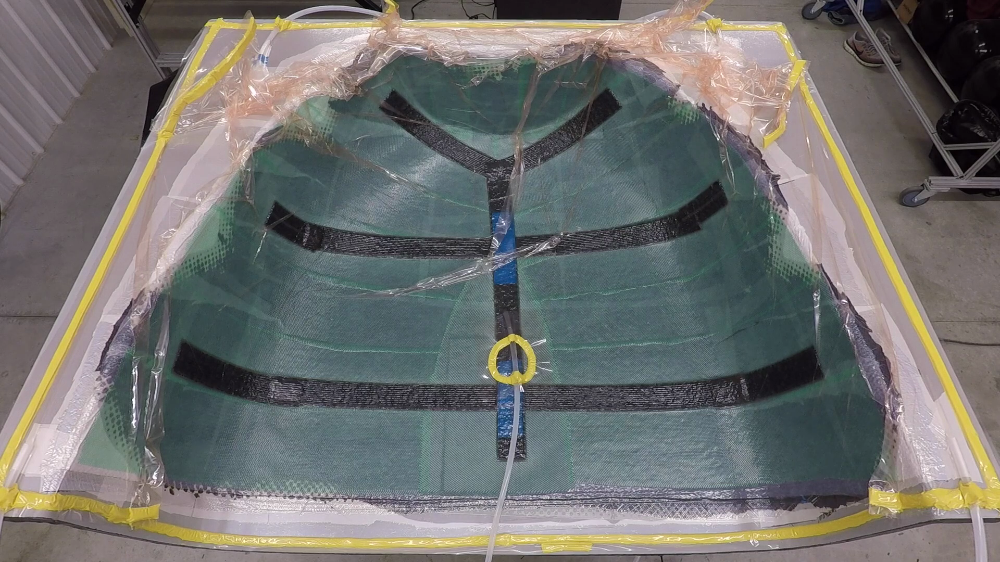
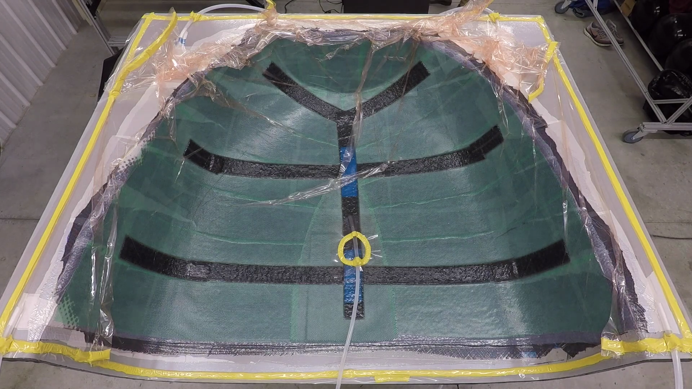

### Sample outputs
Overlay mid-infusion and near-complete:

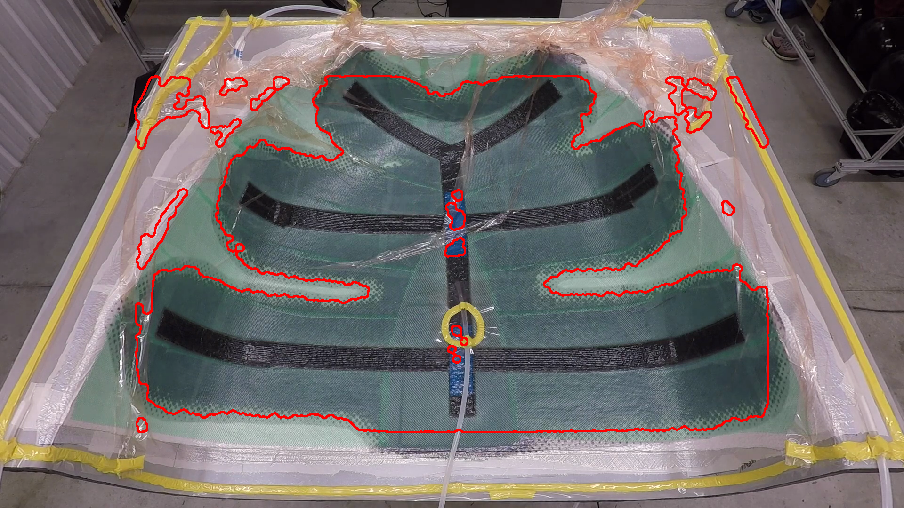
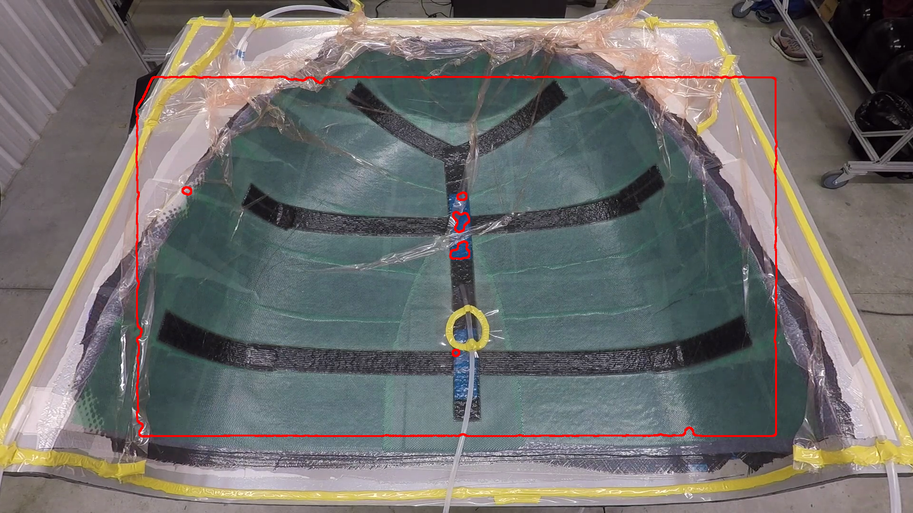

## 4) Algorithm Explanation (10 Phases)
The 10‑phase process below uses a representative frame (≈30% early‑mid progression):

1. Original RGB frame
   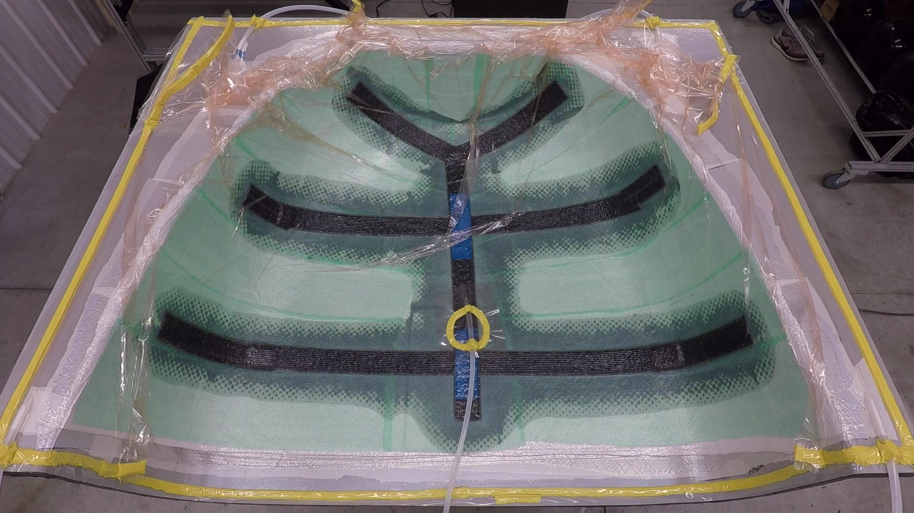
2. Raw contrast to dry reference (CIELAB delta)
   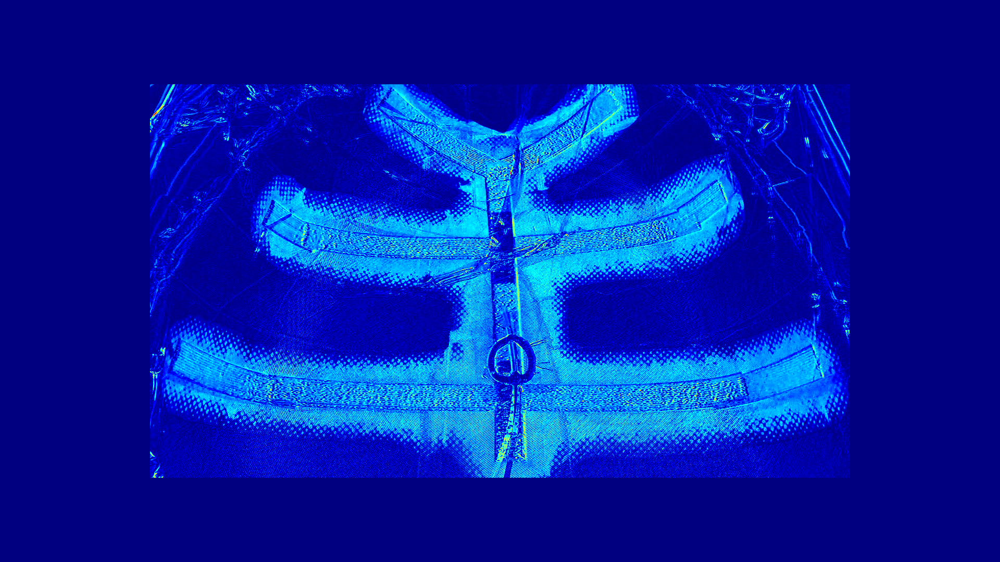
3. Gaussian blur on contrast map (`--blur-kernel`)
   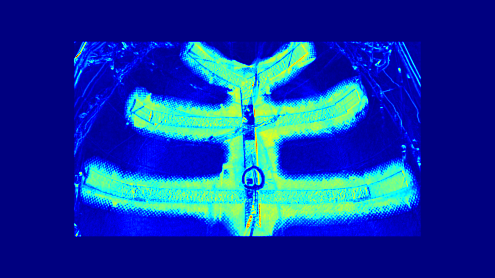
4. Otsu threshold → binary segmentation
   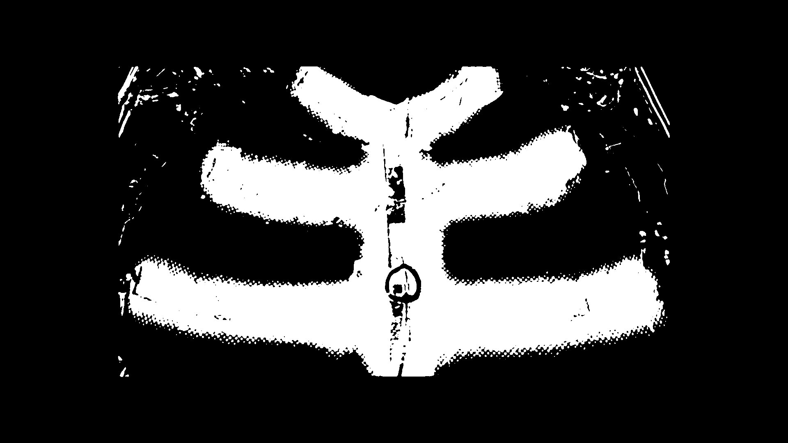
5. Morphological close (fill small gaps)
   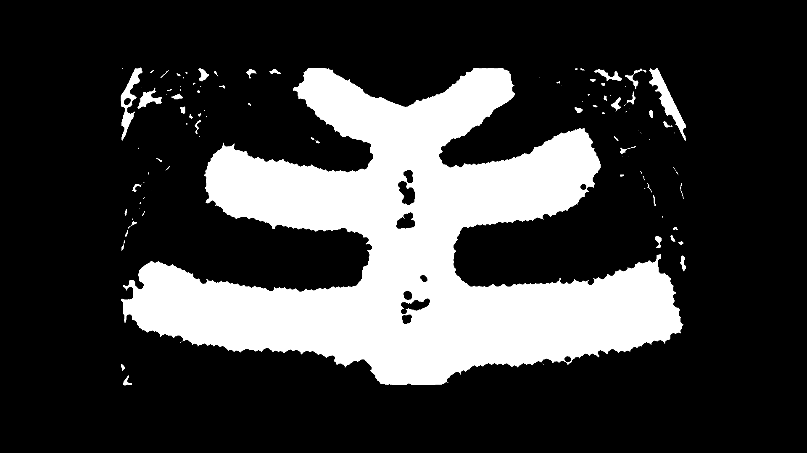
6. Morphological open (remove speckle)
   
7. Small-component filtering (`--min-area`)
   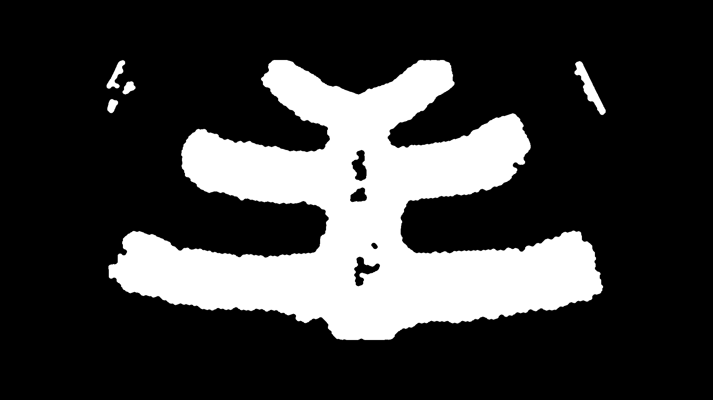
8. Edge gradient of the mask (front border)
   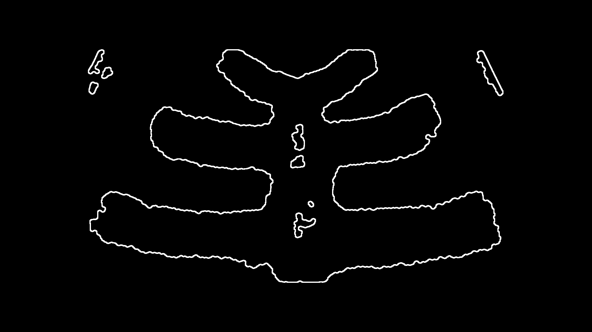
9. Red-edge overlay on original RGB
   
10. Heatmap of normalized contrast (context)
   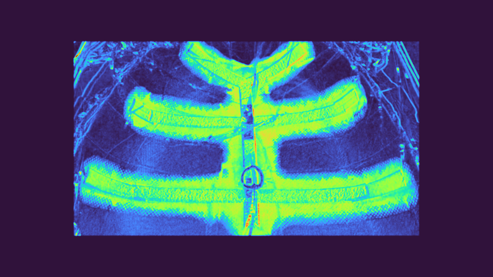

Notes:
- The dry frame (first video frame) is the reference for all later frames.
- ROI cropping is applied internally based on `--roi-margin`.
- Parameters allow trading sensitivity vs. stability across capture conditions.
